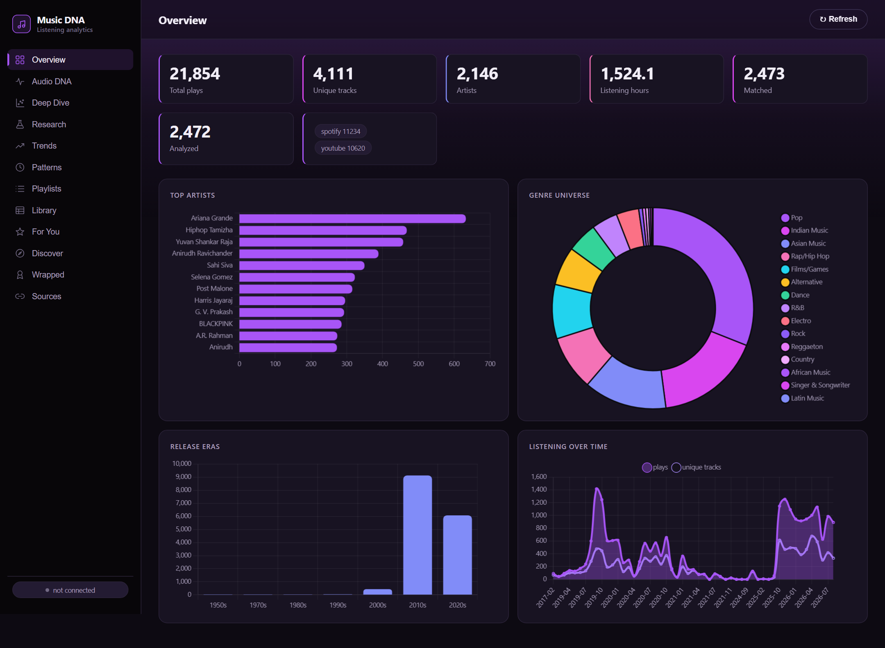
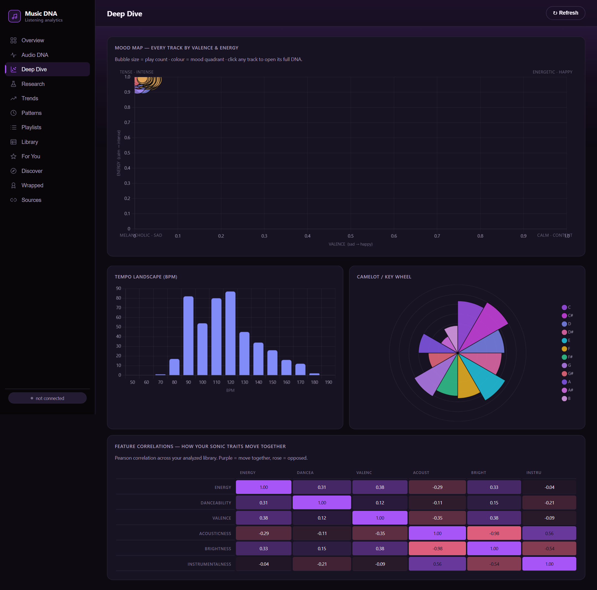
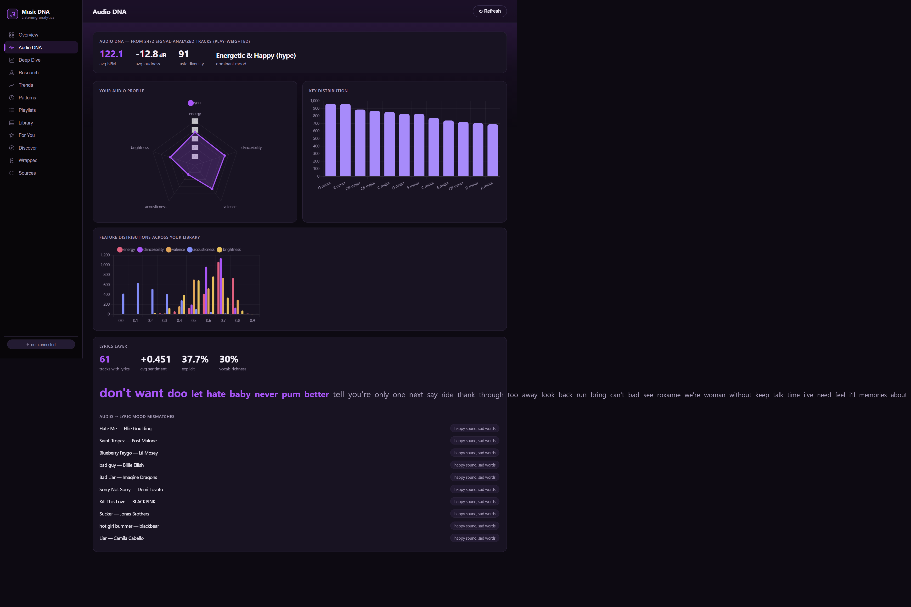
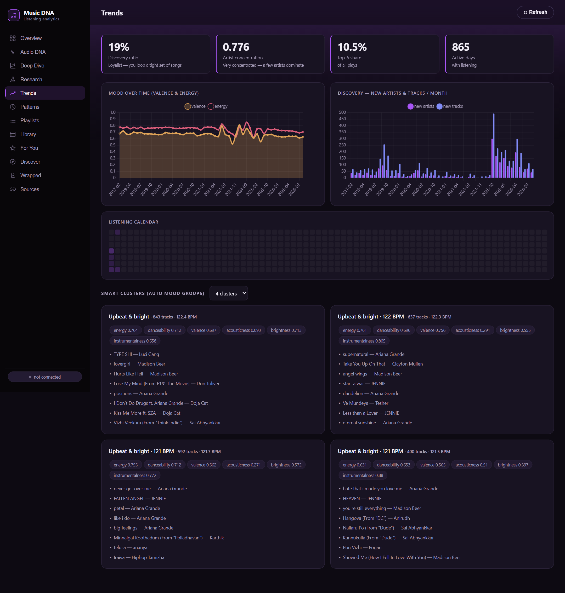
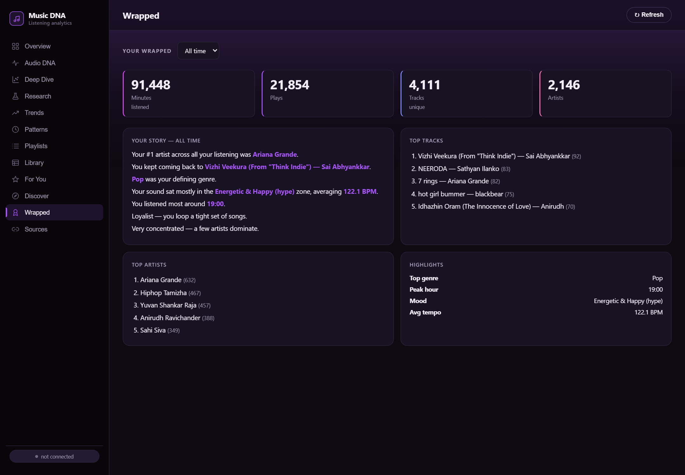
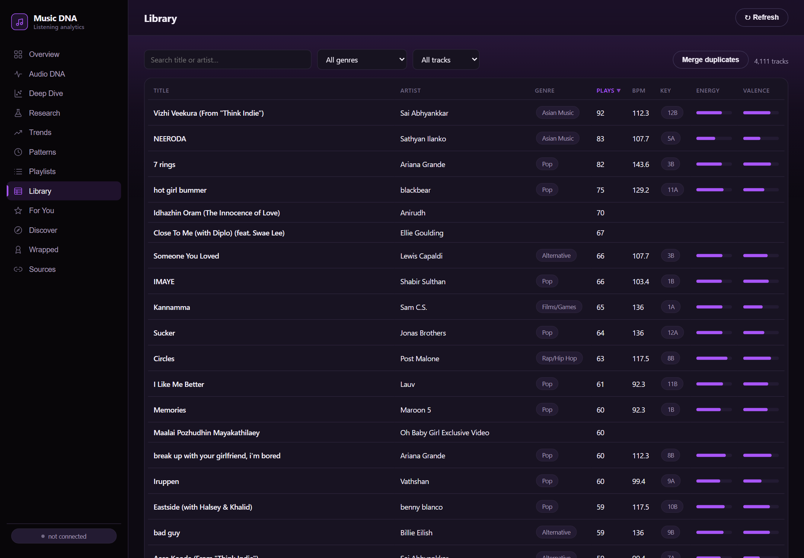

# 🎧 Music DNA Analyzer &nbsp;·&nbsp; `1DNA`

**Deep, local analysis of your music taste across Spotify, YouTube / YouTube Music, and Apple Music.** Macro listening analytics, Shazam-style signal-level DSP on *every* track, a taste model trained on your play history, and a Spotify-style dashboard — all running on your own machine. Your data never leaves your PC.




---

## ✨ What it does

Point it at your listening history and it does three things no streaming app does together: it **measures the actual audio** of every track you've played, it **models your taste** from that measurement, and it lets you **explore all of it** in an interactive dashboard.

### 🔬 Signal-level analysis of every track
For each track it fetches a 30-second preview (via Deezer — free, no key) and runs real DSP with `librosa`:

- **Rhythm** — BPM, tempo confidence, beat regularity, onset density, time-signature estimate, micro-timing
- **Harmony** — musical key + mode (Krumhansl–Schmuckler), key confidence, **Camelot code** for harmonic mixing, harmonic/percussive ratio
- **Loudness & dynamics** — integrated LUFS, loudness range, dynamic spread
- **Timbre & spectrum** — spectral centroid / rolloff / bandwidth / contrast / flatness, HF & sub ratios, a 13-band MFCC fingerprint
- **Estimated 0–1 scores** — energy, danceability, valence, acousticness, instrumentalness, speechiness, liveness
- **Per-track visuals** — mel-spectrogram, chromagram, waveform, tempogram, and an interactive Camelot wheel

### 🧭 Interactive exploration

<table>
<tr>
<td width="50%"></td>
<td width="50%"></td>
</tr>
<tr>
<td align="center"><b>Deep Dive</b> — every track plotted by valence × energy, a tempo landscape, a Camelot key-wheel, and a feature-correlation heatmap. Click any point to open a full DNA breakdown.</td>
<td align="center"><b>Audio DNA</b> — a play-weighted profile of <i>your</i> taste: radar chart, key distribution, feature histograms, and a lyrics layer with sentiment + word cloud.</td>
</tr>
<tr>
<td width="50%"></td>
<td width="50%"></td>
</tr>
<tr>
<td align="center"><b>Trends</b> — mood-over-time, discovery rate, artist concentration (Gini/HHI), a GitHub-style listening calendar, and k-means <b>smart clusters</b> that auto-group your library into mood playlists.</td>
<td align="center"><b>Wrapped</b> — a year-by-year (or all-time) recap: headline stats, top tracks/artists, defining genre, peak hour, mood, and a written narrative.</td>
</tr>
</table>

### 📚 Sortable, filterable library



Every analyzed track in one sortable, filterable table — click a column to sort, filter by genre or analysis status, and open any track for its full signal breakdown. A one-click **Merge duplicates** tool fixes play counts split across mis-parsed rows (see below).

### 🎚️ And more

- **Playlist analyzer** — cohesion score, energy/valence arc, **harmonic-flow analysis** (Camelot transition scoring), outliers, duplicates, use-case classification, and a suggested re-order for smooth flow.
- **Recommendations** — walks Deezer's related-artist graph from your top artists, then re-ranks candidates by how close their *measured* audio features are to your taste vector.
- **Discover** — an optional semantic layer (CLAP audio-text model): search your library by describing a vibe in plain English, plus a taste probe and recommendation-debiasing diagnostics.

---

## 🧬 `deepcut` — the standalone analysis engine

Inside [`deepcut/`](deepcut/) is a **self-contained CLI** that reads audio files, measures them, embeds them with frozen foundation models (MERT + CLAP), and lets you retrieve by example, by sentence, by tempo, or by a taste probe you train yourself. It talks to no streaming platform, so nothing can switch it off.

```bash
deepcut ingest ~/Music     # hash, tag, identify
deepcut analyse            # tempo, key, loudness, structure, synthetic-audio prior
deepcut embed              # frozen MERT + CLAP, structure-aware excerpts
deepcut fit                # remove popularity / anisotropy / hubness from the space
deepcut prompt "murky guitar for a rainy Sunday"
```

It can bootstrap directly from this app's cached previews — see [`deepcut/README.md`](deepcut/README.md).

---

## 🧹 Smart de-duplication

YouTube watch-history titles like `"Vaaste Song: Dhvani Bhanushali | Nikhil D'Souza | …"` get parsed inconsistently across sources, so the same song lands in several rows and its play count splits (a song you played 10× can show as 1). The built-in **Merge duplicates** tool consolidates them with a deliberately high-precision matcher — song-title containment + real shared-artist evidence + a document-frequency filter — so it fixes the splits without ever fusing two genuinely different songs.

---

## 🚀 Quickstart

```bash
git clone https://github.com/srprabu01/1DNA.git
cd 1DNA
pip install -r requirements.txt

# See the whole dashboard alive with demo data (no accounts needed):
python seed_demo.py

# Launch:
python -m uvicorn app.main:app --port 8000
# open http://localhost:8000
```

Then in the **Sources** tab, connect your accounts or import data exports (Spotify *Extended Streaming History*, Google Takeout *watch-history*, Apple Music *Play History* CSV), and run the pipeline: **Match metadata → Analyze audio → (optional) Fetch lyrics**.

Copy `.env.example` to `.env` and add your own API keys only if you want live OAuth sign-in — the import + Deezer-preview path needs no keys.

### Optional: the semantic layer

```bash
pip install torch --index-url https://download.pytorch.org/whl/cu121
pip install transformers
```

Unlocks CLAP text-prompt search and embedding-based similarity/taste on the **Discover** tab (~600 MB model download; a GPU is recommended).

---

## 🏗️ Architecture

```
app/
  ingest/        Spotify / YouTube Data API / YT-Music / Apple / Takeout importers
  enrich/        Deezer metadata + 30s preview matching
  audio/         librosa DSP, structure segmentation, Camelot, server-side visuals
  analytics/     macro stats, clusters, PCA research, taste probe, similarity
  lyrics/        sentiment + vocabulary analysis
  playlist/      cohesion, harmonic-flow, energy-arc, re-order
  recommend/     related-artist graph walk + feature re-ranking
  report/        Spotify-Wrapped-style recap
  maintenance/   duplicate detection + merge
  main.py        FastAPI app + JSON API
static/
  index.html     single-file Chart.js dashboard (purple "Spotify" theme)
deepcut/         standalone MERT + CLAP analysis/retrieval engine
```

**Stack:** FastAPI · SQLite · NumPy / SciPy / scikit-learn · librosa · matplotlib · vanilla JS + Chart.js. Optional: PyTorch + Transformers (MERT, CLAP).

---

## 🔒 Privacy

Everything runs locally against a SQLite database on your machine. No listening data, tokens, or audio is uploaded anywhere. This repository contains **only source code** — the personal database, OAuth tokens, cached audio, and `.env` are all git-ignored.

---

## 📄 License

MIT — see [`LICENSE`](LICENSE).

<sub>Built by <a href="https://github.com/srprabu01">Sri Ram Prabu Elenchezhian</a>. Music previews © their respective owners, served via Deezer for analysis only.</sub>
