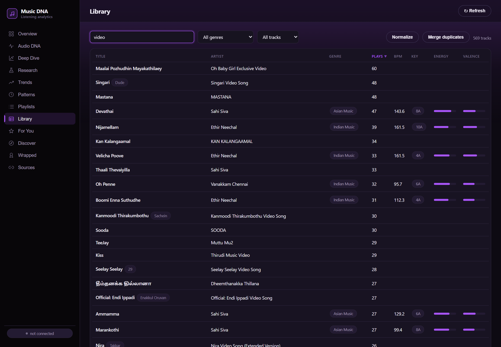

# Song-Normalization ETL

How the library turns messy, multi-source, multi-language track rows into clean,
normalized fields — **song name**, **artist**, and the **movie / album** each song
belongs to — plus flags for **Shorts** and **non-music**.

Implemented in [`app/maintenance/normalize.py`](../app/maintenance/normalize.py).
The rule set was derived by analysing the real library and is reproduced here as
the authoritative, step-by-step record.

---

## Why this is needed

The same song arrives with wildly different metadata depending on where it came
from (YouTube watch-history, YouTube Data API, Spotify export, Apple Music CSV,
Deezer enrichment). YouTube titles in particular bury the song name inside a
long, punctuation-heavy string, and frequently put the **movie in the artist
field** and the **song in the title** (or vice-versa):

| Raw title | Raw artist | The truth |
|---|---|---|
| `Singari (From "Dude")` | `Sai Abhyankkar` | song **Singari**, movie **Dude** |
| `Takkunu Takkunu Video Song \| Sivakarthikeyan…` | `Mr.Local` | song **Takkunu Takkunu**, movie **Mr. Local** |
| `Ethirum Puthirum (1999) \| Vidyasagar \| Tamil Hit Song` | `Thottu Thottu Pesum Sulthana Song` | song **Thottu Thottu Pesum Sulthana**, movie **Ethirum Puthirum** |
| `ITZY "SNEAKERS" M/V @ITZY` | `JYP Entertainment` | song **Sneakers**, artist **ITZY** (label discarded) |
| `Old Town Road - Remix` | `Lil Nas X` | song **Old Town Road (Remix)** |

**Guiding principle — precision over recall.** A wrong normalization is worse
than a missing one, so any field that cannot be resolved confidently is left
`NULL` rather than guessed. The raw `title` and `artist` are **never mutated**,
so the ETL is idempotent and re-runnable.

The result, in the Library — clean song names with their movie/album tagged:



---

## Architecture

```
        EXTRACT                 TRANSFORM                         LOAD
  ┌───────────────┐   ┌────────────────────────────┐   ┌────────────────────┐
  │ read raw rows │──▶│ ordered rule stages         │──▶│ write 4 new columns │
  │ (title,artist,│   │ (gates → classify → extract │   │ (raw kept intact)   │
  │  album)       │   │  → album fallback)          │   │                     │
  └───────────────┘   └────────────────────────────┘   └────────────────────┘
```

Output columns added to `tracks`: `clean_title`, `movie_album`, `is_short`,
`is_non_music`, `normalized_at`.

---

## The steps

### 1 · Extract — `load_raw_records`
Read `(title, artist)`. NFKC-fold styled/mathematical unicode **for detection
only** (`𝐊𝐩𝐨𝐩` → `Kpop`, `▲YUSH` → `YUSH`) while keeping the original casing and
script for output. Nothing is lowercased or stripped yet — later rules depend on
ALL-CAPS and script signals.

### 2 · Transform — `nonmusic_gate` (runs first)
Set `is_non_music = true` and skip song extraction when the title/artist matches
a non-music signal, so DJ sets, dramas, reels and promos never yield a fake song:
- whole-set / compilation: `full set`, `dj set`, `club set`, `mixtape`,
  `mix playlist`, `mashup`, `jukebox`, `full album`
- long-form / lifestyle: `reaction`, `vlog`, `trailer`, `gameplay`, `podcast`,
  `interview`, `documentary`, `workout`, `behind the scenes`, `live-action`
- drama episodes: `EP<n> … ENG SUB` / `(DUBBED)` / `【…Drama…】`
- product / job promos: `auto-apply`, `custom resume`, `job search`, `AI agent`
- **kept as music:** a single named song `(Live Performance)` / `(Live at …)`,
  remixes/club-mixes of a real song, instrumental/piano covers, K-drama & anime
  OSTs, official MVs.

### 3 · Transform — `shorts_gate`
Set `is_short` independently:
- literal `#shorts` / `Shorts` / `/shorts/` URL
- ≥ 2 hashtags (especially with emoji + a channel-like artist)
- dance/reel tags: `#dance`, `#dancechallenge`, `#tiktok`, `#viral`, `#fyp`,
  `#reels`; choreography credits `Dc-` / `By @dancer`; `*Challenge`
- **override:** a full drama episode (`EP<n> ENG SUB`) is non-music but *long-form*
  → `is_short = false`.

### 4 · Transform — `classify_artist_field`
Decide **what the artist field actually holds** before trusting it — this drives
which extraction branch runs:
- **Label / distributor** (`… Entertainment/Records/Media/Official`, `1theK`,
  `HYBE`, `JYP`, `T-Series`, `Sun Music`, `Sony Music South`, …) → discard.
- **Song-in-artist** — ALL-CAPS (and not a known band like `ITZY`/`BTS`), or ends
  with `…Song` / `…Lyric` / `(Extended Version)`, or is Tamil/Telugu/Hangul script
  while the title is pipe-metadata → the artist field **is the song**.
- **Movie-in-artist** — the artist equals a leading pipe segment of the title or a
  known film → the artist field **is the movie**.
- **@handle / channel** → discard.
- **else Performer** — use the artist field verbatim.

### 5 · Transform — `strip_handles_and_scrub`
On a **working copy** of the title, remove every `@handle`, `#hashtag`, emoji and
decorative unicode. A surviving `@handle` in an Indian pipe title is almost always
the **composer** — recorded for last-resort artist resolution, never printed as
`@…`.

### 6 · Transform — `extract_movie_from_markers`
Pull `movie_album` from explicit markers, then delete that span before song
parsing (so the parenthetical `From` wins over any dash and internal song dashes
survive):
- `From "X"` / `(From X)` / `[From "X"]` / `- From X` (curly or straight quotes)
- strip trailing language tags: `Monica (From "Coolie") (Tamil)` → **Coolie**
- bracketed OST: `[… OST Part N]`
- swapped-pipe: the first `|` segment of the title, minus year `(1999)` and
  `Tamil Movie` / `Movie Songs` noise
- colon prefix: `Movie: Song …` → the pre-colon part is the movie.

### 6b · Transform — `movie_from_album` (fallback)
When the title carried **no** movie marker, fall back to the track's `album`
column and promote it to `movie_album` **only if it names a film**:
- `X (Original Motion Picture Soundtrack)` / `(Motion Picture Score)` /
  `(Original Soundtrack)` → movie **X**
- `Music from the Motion Picture X` / `From the Motion Picture "X"` → movie **X**

A plain album (`Nine Track Mind`, `÷`, `Map of the Soul: 7`) is **never** promoted
— it stays in `album` and `movie_album` is left empty. An explicit title marker
from step 6 always wins over the album, so `Naatu Naatu (From "RRR")` on a
mislabelled compilation album still resolves to **RRR**. This is what turns the
Apple Music export's rich soundtrack albums into movie tags (see below).

### 7 · Transform — `extract_song`
Extract `clean_song` using the first matching branch (in order):
1. **From-movie** — text before the `From` clause.
2. **Streaming-feat** — strip `(feat. …)` / `ft.` / `with …`.
3. **K-pop quoted MV** — `Artist "Song" M/V` → the quoted token is the song, the
   leader before the quote is the artist (label field discarded).
4. **Pipe / handle split** — first surviving non-noise, non-handle segment.
5. **ALL-CAPS-artist-is-song** — TitleCase the artist field (`KELAYO` → `Kelayo`).
6. **Swapped-pipe** — the song sat in the artist field; the movie leads the title.
7. **Cover** — `Song Cover by Artist` → cover performer wins.
8. **Colon-prefix** — `Movie: Song` → post-colon.
9. **Dash-tail** — split on the **last** ` - `; a version keyword tail becomes a
   kept qualifier (`Old Town Road - Remix` → `Old Town Road (Remix)`), a poetic
   subtitle is dropped, `movie_album` stays empty.
10. **Clean fallback** — trim separators/emoji; whatever remains is the song.

### 8 · Transform — `resolve_artist`
Default to the artist field when it is a real performer. Otherwise reject it
(label, `@handle`, movie, or song-in-field) and derive from the title: the K-pop
leader, a `@handle`→composer map (`@ARRahman` → `A.R. Rahman`), or `NULL`.

### 9 · Transform — `final_song_normalization`
Applied to every branch's output: strip noise tokens
(`Official Music Video`, `Video Song`, `M/V`, `4K/8K/HD`, bare `Video`/`Audio`,
`Song`…), year parens, language tags, standalone `Unplugged`/`Instrumental`/
`Acoustic`, hashtags and emoji; collapse whitespace; TitleCase an ALL-CAPS song.
**Preserved:** real subtitles (`(How Will I Know)`), internal commas
(`nowhere, nobody`), `?`, ellipses, and intentional lowercase (`yes baby`).

### 10 · Load — `assemble_and_validate`
Write `{clean_title, movie_album, is_short, is_non_music, normalized_at}`. Leave
`movie_album` empty for standalone singles and for poetic dash-subtitles that do
not resolve to a known film (never a composer / singer / actor / handle / label).

---

## Running it

```python
from app.maintenance import normalize

normalize.preview(limit=60)   # dry-run: before/after rows, no writes
normalize.run()               # full ETL: adds/updates the normalized columns
```

Or from the dashboard **Library** tab → **Normalize library** (preview → confirm →
apply), served by `POST /api/normalize/apply` and `GET /api/normalize/preview`.

The raw `title`/`artist` are never overwritten, so the ETL is safe to re-run after
every import.

---

## Feeding the ETL: the Apple Music export

The Apple Media Services export ("Get a copy of your data" → *Apple Media
Services* at [privacy.apple.com](https://privacy.apple.com)) ships several CSVs;
[`app/ingest/apple.py`](../app/ingest/apple.py) uses two of them, for different
reasons:

| File | Role | Why |
|---|---|---|
| **`Apple Music - Play History Daily Tracks.csv`** | tracks + plays | Only Apple file with the track's **artist** (`Track Description` = `"Artist - Title"`), plus a per-day **`Play Count`** and `Date Played`. |
| **`Apple Music Play Activity.csv`** | album metadata only | Event-level log with `Song Name` + **`Album Name`** but *no* track artist — importing plays from it would label everything "Unknown", so it is used only to fill the `album` column. |

Two details matter for accuracy:

- **`Play Count` is honoured.** A song played 3× on one day becomes **3** play
  events (at distinct within-day timestamps), not one — the same fix that keeps
  counts like *Vaaste* honest. A row with a blank/zero count still counts as one
  listen (the row exists because the track was engaged that day).
- **Albums are matched precision-first.** A song title is enriched with an album
  only when Play Activity maps it to *exactly one* album; ambiguous titles (seen
  under two albums) are left alone rather than guessed. Those albums then feed
  **step 6b**, which is how soundtracks like *"Vaaranam Aayiram (Original Motion
  Picture Soundtrack)"* become the movie tag **Vaaranam Aayiram**.

```python
from app.ingest import apple
apple.import_directory("/path/to/unzipped/Apple Media Services information")
# or upload a single CSV via the Sources tab → POST /api/import/apple
```

`import_directory` folds both files into one pass; a single-file upload of Daily
Tracks imports history, and a later upload of Play Activity back-fills albums on
the tracks already present. Re-running is idempotent (plays are unique on
`track_id, played_at, source`).

---

## Precision notes & known limits

- A bare `Song - ProperNoun` tail is only treated as a movie if it resolves to a
  known film; otherwise it is kept as part of the song and `movie_album` is left
  empty (poetic subtitles like *"The Kiss of Love"* are **not** misfiled as films).
- Same-name collisions across different songs cannot be disambiguated from text
  alone. Where a track carries an `album` (from the Apple export, or Deezer
  enrichment), a **soundtrack** album is the more authoritative movie source and
  is applied by step 6b — but only for genuine film soundtracks, and only when
  the title itself gave no marker.
- The Play Activity album match is keyed on song title only (that file has no
  artist), so two distinct songs sharing a title could receive the same album;
  this is why only *unambiguous* title→album mappings are used, and why the
  album must look like a soundtrack before it becomes a `movie_album`.
- `is_short` / `is_non_music` are conservative flags for review, not automatic
  deletion — they let you filter Shorts and non-music out of analysis and stats.
